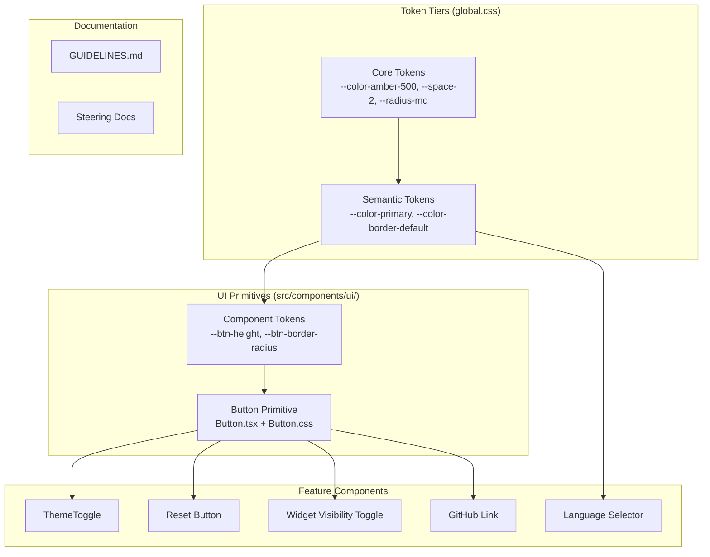
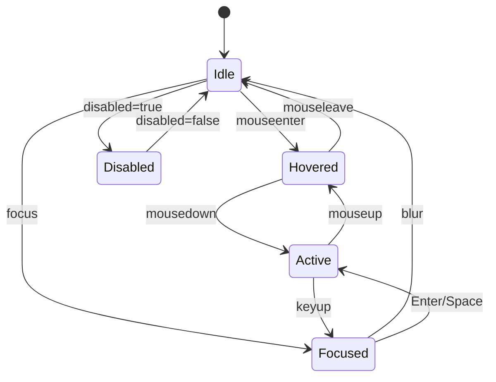

# Design Document: Header Design System

## Overview

This design introduces a foundational design system for Bürküt, starting with a three-tier design token architecture and a `Button` UI primitive. The system normalizes all header controls (ThemeToggle, Reset Layout, Widget Visibility, Language Selector, GitHub Link) to share consistent sizing, borders, and interaction styles.

The approach follows the W3C Design Tokens Community Group (DTCG) conceptual model: **core tokens** (raw values) → **semantic tokens** (contextual meaning) → **component tokens** (scoped to primitives). All tokens are implemented as CSS custom properties in plain CSS — no CSS-in-JS, no build-time token tooling.

The `Button` primitive is polymorphic: it renders `<button>` by default and `<a>` when an `href` prop is provided. This lets the GitHub link share the same visual treatment as icon buttons without duplicating styles.

A machine-readable `GUIDELINES.md` document accompanies the primitives, enabling both human developers and AI agents to extend the system consistently.

### Key Design Decisions

1. **CSS custom properties only** — Tokens live in `global.css` as CSS variables. No JSON token files or build-time transforms. This keeps the stack simple and aligns with the existing Vite + plain CSS approach.
2. **Additive migration** — Existing ad-hoc variables (e.g., `--accent`, `--bg-surface`) become semantic tokens. New core tokens are added alongside them. No breaking rename of existing variables in Phase 1 — aliases bridge old names to new tokens.
3. **Polymorphic Button via discriminated unions** — TypeScript conditional types ensure `href` triggers `<a>` rendering with anchor-specific props, while `onClick` stays on the `<button>` path. No runtime type checks needed.
4. **`src/components/ui/` directory** — Primitives live separately from feature components. A barrel `index.ts` re-exports everything for clean imports.
5. **Native `<select>` preserved** — The Language Selector stays a native `<select>` for accessibility and platform behavior. It adopts shared tokens for height and border-radius but doesn't become a Button.

## Architecture



### Token Flow

```
Core Token                    Semantic Token              Component Token
──────────────────────────    ────────────────────────    ─────────────────────
--color-amber-500: #f29b17 → --color-primary: var(…)  → --btn-border-hover: var(--color-primary-a44)
--radius-md: 6px           → --radius-control: var(…) → --btn-border-radius: var(--radius-control)
--space-2: 0.25rem         →                          → --btn-padding: var(--space-2)
```

## Components and Interfaces

### Button Primitive (`src/components/ui/Button/Button.tsx`)

```typescript
import type { ComponentPropsWithoutRef, ReactNode } from "react";

// Base props shared by both button and anchor variants
interface ButtonBaseProps {
  variant?: "icon" | "text";
  children: ReactNode;
  className?: string;
}

// Button-specific props (no href)
interface ButtonAsButton extends ButtonBaseProps, ComponentPropsWithoutRef<"button"> {
  href?: never;
  target?: never;
  rel?: never;
}

// Anchor-specific props (href provided)
interface ButtonAsAnchor extends ButtonBaseProps, ComponentPropsWithoutRef<"a"> {
  href: string;
}

export type ButtonProps = ButtonAsButton | ButtonAsAnchor;

export function Button(props: ButtonProps): JSX.Element;
```

**Behavior:**
- Default `variant` is `"icon"`
- When `href` is provided → renders `<a>` with anchor attributes
- When `href` is absent → renders `<button type="button">`
- CSS classes: `btn`, `btn--icon`, `btn--text`
- Forwards all standard HTML attributes to the underlying element
- `disabled` state: reduced opacity, `cursor: not-allowed`, no click propagation

### Barrel Export (`src/components/ui/index.ts`)

```typescript
export { Button } from "./Button/Button";
export type { ButtonProps } from "./Button/Button";
```

### ThemeToggle (migrated)

```typescript
// Internal change only — public API unchanged
// Replaces <button className="theme-toggle"> with <Button variant="icon">
import { Button } from "../ui";
```

### WidgetVisibilityMenu (migrated)

```typescript
// Toggle button changes from <button className="widget-visibility-menu__toggle">
// to <Button variant="text">
import { Button } from "../ui";
```

### Language Selector (normalized, not migrated)

Stays as a native `<select>`. Adopts shared tokens:
- `height: var(--btn-height)` for vertical alignment
- `border-radius: var(--btn-border-radius)` for visual consistency
- `border-color: var(--color-border-default)` / hover: `var(--color-border-hover)`

### GitHub Link (migrated)

```typescript
// Changes from raw <a> to <Button variant="icon" href="...">
import { Button } from "../ui";
```

### Reset Button (migrated in App.tsx)

```typescript
// Changes from <button className="reset-layout-btn"> to <Button variant="icon">
import { Button } from "../ui";
```


## Data Models

### Design Token Taxonomy

Tokens are organized in `src/styles/global.css` as CSS custom properties. No JSON schema or build tooling — the CSS file is the single source of truth.

#### Core Tokens (`:root`)

| Category | Naming Pattern | Examples |
|----------|---------------|----------|
| Color | `--color-{name}-{scale}` | `--color-amber-500`, `--color-gray-100`, `--color-gray-900` |
| Spacing | `--space-{scale}` | `--space-1` (0.125rem), `--space-2` (0.25rem), `--space-4` (0.5rem) |
| Border Radius | `--radius-{size}` | `--radius-sm` (4px), `--radius-md` (6px), `--radius-lg` (8px) |
| Font Size | `--font-size-{size}` | `--font-size-xs` (0.75rem), `--font-size-sm` (0.85rem) |
| Duration | `--duration-{speed}` | `--duration-fast` (0.15s), `--duration-normal` (0.25s) |

#### Semantic Tokens (`:root` + `[data-theme="dark"]`)

| Token | Light Value | Dark Value | Purpose |
|-------|------------|------------|---------|
| `--color-primary` | `var(--color-amber-500)` | `var(--color-amber-400)` | Brand accent |
| `--color-bg-body` | `#f0f2f5` | `#1c2128` | Page background |
| `--color-bg-surface` | `#ffffff` | `#22272e` | Card/panel background |
| `--color-bg-surface-alt` | `#f6f8fa` | `#2d333b` | Alternate surface |
| `--color-text-primary` | `#1f2328` | `#adbac7` | Primary text |
| `--color-text-secondary` | `#656d76` | `#768390` | Secondary text |
| `--color-border-default` | `#d1d9e0` | `#444c56` | Default borders |
| `--color-border-hover` | `var(--color-primary-a44)` | `var(--color-primary-a44)` | Hover border accent |
| `--color-hover-bg` | `rgba(208,215,222,0.32)` | `rgba(99,110,123,0.16)` | Hover background |
| `--radius-control` | `var(--radius-md)` | `var(--radius-md)` | Standard control radius |

#### Component Tokens (in `Button.css`)

| Token | Default Value | Purpose |
|-------|--------------|---------|
| `--btn-height` | `28px` | Consistent control height |
| `--btn-border-radius` | `var(--radius-control)` | Border radius |
| `--btn-padding-x` | `var(--space-3)` | Horizontal padding (text variant) |
| `--btn-font-size` | `var(--font-size-sm)` | Text size (text variant) |

### Migration Mapping

Existing ad-hoc variables map to the new token tiers. Phase 1 preserves backward compatibility by keeping old names as aliases.

| Old Variable | New Core Token | New Semantic Token |
|-------------|---------------|-------------------|
| `--accent` | `--color-amber-500` | `--color-primary` |
| `--bg-body` | — | `--color-bg-body` |
| `--bg-surface` | — | `--color-bg-surface` |
| `--text-primary` | — | `--color-text-primary` |
| `--border-default` | — | `--color-border-default` |
| `--hover-bg` | — | `--color-hover-bg` |

In Phase 1, old names remain as aliases pointing to the new semantic tokens (e.g., `--accent: var(--color-primary)`). This avoids a mass find-and-replace across all component CSS files. Future phases can migrate consumers and remove aliases.

### Button Component State Machine



States map to CSS:
- **Idle**: `.btn` base styles
- **Hovered**: `.btn:hover` — `background: var(--color-hover-bg)`, `border-color: var(--color-border-hover)`
- **Focused**: `.btn:focus-visible` — focus ring using `outline`
- **Active**: `.btn:active` — slight scale or background shift
- **Disabled**: `.btn:disabled` / `.btn[aria-disabled="true"]` — `opacity: 0.5`, `cursor: not-allowed`


## Correctness Properties

*A property is a characteristic or behavior that should hold true across all valid executions of a system — essentially, a formal statement about what the system should do. Properties serve as the bridge between human-readable specifications and machine-verifiable correctness guarantees.*

### Property 1: Element type determined by href

*For any* set of valid Button props, if `href` is provided the rendered root element should be an `<a>` tag, and if `href` is absent the rendered root element should be a `<button>` tag with `type="button"`.

**Validates: Requirements 3.1, 4.1**

### Property 2: Variant determines CSS class

*For any* Button rendered with variant `"icon"` or `"text"` (or no variant, defaulting to `"icon"`), and regardless of whether it renders as `<button>` or `<a>`, the root element should have the CSS class `btn--icon` when variant is `"icon"` (or omitted) and `btn--text` when variant is `"text"`. The base class `btn` should always be present.

**Validates: Requirements 3.2, 3.3, 3.4, 4.3**

### Property 3: Attribute forwarding preserves all props

*For any* combination of `aria-label`, `title`, `aria-expanded`, `aria-pressed`, `disabled`, and `className` props passed to Button, each provided attribute should appear on the rendered DOM element with the exact value that was passed.

**Validates: Requirements 3.6, 3.7, 3.9, 12.4**

### Property 4: Anchor-specific attributes forwarded

*For any* Button rendered with an `href` prop, the `href`, `target`, and `rel` attributes should all be forwarded to the rendered `<a>` element with their exact provided values.

**Validates: Requirements 4.2**

## Error Handling

### Button Primitive

| Scenario | Behavior |
|----------|----------|
| `disabled` on `<button>` | Native disabled behavior: no click events fire, `opacity: 0.5`, `cursor: not-allowed` |
| `disabled` on `<a>` (href variant) | Apply `aria-disabled="true"`, `role="link"`, prevent navigation via `onClick` handler calling `e.preventDefault()`. Native `<a>` has no `disabled` attribute. |
| Missing `aria-label` on icon variant | Biome lint rule `useAriaPropsSupportedByRole` won't catch this directly, but the GUIDELINES.md will document that icon-only buttons require `aria-label`. A future lint rule or test can enforce this. |
| Invalid `variant` value | TypeScript union type `"icon" | "text"` prevents this at compile time. No runtime fallback needed. |
| `onClick` + `href` both provided | `href` takes precedence — renders as `<a>`. The `onClick` is still forwarded (useful for analytics tracking on link clicks). |

### Token System

| Scenario | Behavior |
|----------|----------|
| Missing core token | CSS `var()` with no fallback renders as `unset`. The GUIDELINES.md documents that all semantic tokens must reference existing core tokens. |
| Theme not set | `:root` provides light theme defaults. `[data-theme="dark"]` overrides only apply when the attribute is present. |
| Old variable name used | Aliases in `global.css` bridge old names to new semantic tokens. No breakage during migration. |

## Testing Strategy

### Testing Framework

- **Unit/Integration tests**: Vitest + @testing-library/react + jsdom (already configured)
- **Property-based tests**: fast-check (already installed as `fast-check@^4.5.3`)
- **CSS**: `css: true` is enabled in vitest config, so CSS classes are applied in tests

### Unit Tests

Unit tests cover specific examples, edge cases, and integration points:

**Button Primitive (`src/components/ui/Button/Button.test.tsx`)**
- Default render produces `<button type="button">` (Req 12.1)
- Icon variant applies `btn--icon` class (Req 12.2)
- Text variant applies `btn--text` class (Req 12.3)
- `href` renders `<a>` element (Req 12.5)
- `onClick` fires on click (Req 12.6)
- `disabled` prevents `onClick` (Req 12.7, edge case)
- Children are rendered in the DOM
- `className` prop is merged with internal classes

**ThemeToggle Migration (`src/components/ThemeToggle/ThemeToggle.test.tsx`)**
- Renders with `btn` and `btn--icon` classes (Req 5.1)
- Has correct `aria-label` and `title` (Req 5.2)
- Shows Sun icon in dark mode, Moon in light mode (Req 5.3)

**WidgetVisibilityMenu Migration (`src/components/WidgetVisibilityMenu/WidgetVisibilityMenu.test.tsx`)**
- Toggle button has `btn` and `btn--text` classes (Req 7.1)
- Passes `aria-expanded` through to Button (Req 7.3)
- Dropdown still opens/closes on click (Req 7.4)

**App Header Integration (`src/App.test.tsx` or inline)**
- Reset button uses Button primitive with icon variant (Req 6.1)
- GitHub link renders as `<a>` with `target="_blank"` and `rel="noreferrer"` (Req 9.3)
- GitHub link has `aria-label="GitHub"` (Req 9.4)
- Language selector remains a `<select>` element (Req 8.4)

### Property-Based Tests

Each correctness property is implemented as a single property-based test using `fast-check`. Minimum 100 iterations per test.

**File: `src/components/ui/Button/Button.property.test.tsx`**

| Test | Property | Tag |
|------|----------|-----|
| Element type by href | Property 1 | `Feature: header-design-system, Property 1: Element type determined by href` |
| Variant CSS class | Property 2 | `Feature: header-design-system, Property 2: Variant determines CSS class` |
| Attribute forwarding | Property 3 | `Feature: header-design-system, Property 3: Attribute forwarding preserves all props` |
| Anchor attributes | Property 4 | `Feature: header-design-system, Property 4: Anchor-specific attributes forwarded` |

**Generator strategy:**
- Generate random strings for `aria-label`, `title`, `href`, `target`, `rel`, `className`
- Generate random booleans for `disabled`, `aria-expanded`, `aria-pressed`
- Generate random variant from `["icon", "text", undefined]`
- Use `fc.option()` for optional props to test presence/absence combinations
- Filter generated `href` values to valid URL-like strings when testing anchor path

**Configuration:**
- Each test runs with `{ numRuns: 100 }` minimum
- Each test file includes a comment referencing the design property it validates

