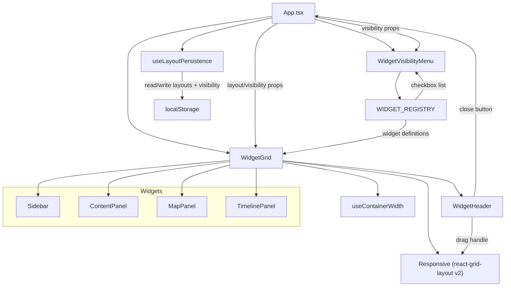

# Design Document: react-grid-layout-widgets

## Overview

This design replaces the current `react-resizable-panels` (v4.6.5) layout system in Bürküt with `react-grid-layout` v2, transforming the four application panels (Sidebar, ContentPanel, MapPanel, TimelinePanel) into draggable, resizable widgets on a 12-column responsive grid with vertical compaction.

The migration touches five main areas:

1. A new `WidgetGrid` component that wraps `react-grid-layout`'s `Responsive` component with `useContainerWidth` for width measurement
2. A new `WidgetHeader` component replacing `PanelHeader` as the drag handle for each widget, including a close button to hide individual widgets
3. A `useLayoutPersistence` hook managing layout state and visibility state in localStorage with fallback to defaults
4. A `WIDGET_REGISTRY` configuration array that serves as the single source of truth for all available widget types, their default layouts, and i18n keys
5. A `WidgetVisibilityMenu` dropdown component in the app header that lets users toggle widget visibility via checkboxes

The existing `config.features.draggableLayout` flag gates drag/resize behavior — when `false`, widgets render in a static arrangement with no drag affordances, close buttons are hidden, and the visibility menu is not shown.

Key research findings from react-grid-layout v2:
- v2 is a full TypeScript rewrite using hooks (`useContainerWidth`, `useGridLayout`, `useResponsiveLayout`)
- The `Responsive` component handles breakpoint switching automatically
- `verticalCompactor` is the default compaction strategy
- Width is provided via `useContainerWidth` hook (returns `{ width, containerRef, mounted }`)
- Layout items use the interface `{ i: string, x: number, y: number, w: number, h: number, minW?, maxW?, minH?, maxH?, static? }`
- CSS imports required: `react-grid-layout/css/styles.css` and `react-resizable/css/styles.css`
- `onLayoutChange` callback fires on every drag/resize for persistence
- `dragConfig.handle` accepts a CSS selector string for the drag handle

## Architecture



The architecture is a straightforward replacement: `App.tsx` currently renders nested `Group > Panel > Separator` trees from `react-resizable-panels`. After migration, `App.tsx` renders a single `WidgetGrid` component that internally uses `Responsive` from `react-grid-layout`. Each child is wrapped in a `div` with a `key` matching the layout item's `i` field, and each gets a `WidgetHeader` as its drag handle. The `WIDGET_REGISTRY` is the single source of truth for all widget types — both `WidgetGrid` and `WidgetVisibilityMenu` consume it to determine which widgets exist and how to render them.

> **Post-migration fix:** `useLayoutPersistence` is called only in `App.tsx`, not in `WidgetGrid`. All layout/visibility state flows down as props. The original architecture diagram showed `WG --> LP` but the final implementation has `App --> LP` with props passed to `WG`. This avoids duplicate React state instances.

### Component Hierarchy (After Migration)

```
App
├── app-header (unchanged, + reset layout button, + WidgetVisibilityMenu)
└── app-body
    └── WidgetGrid (filters children by visibility state)
        ├── div[key="sidebar"]
        │   ├── WidgetHeader (drag handle + close button)
        │   └── Sidebar
        ├── div[key="content"]
        │   ├── WidgetHeader (drag handle + close button)
        │   └── ContentPanel
        ├── div[key="map"]
        │   ├── WidgetHeader (drag handle + close button)
        │   └── MapPanel
        └── div[key="timeline"]
            ├── WidgetHeader (drag handle + close button + group toggles)
            └── TimelinePanel
```

### Resize Propagation

MapPanel and TimelinePanel already use `useResizeObserver` to detect container size changes and call `invalidateSize()` / `redraw()` respectively. Since `react-grid-layout` changes the widget's DOM dimensions directly, the existing `ResizeObserver`-based approach continues to work without modification. The debounce in `useResizeObserver` (default 100ms) naturally handles continuous drag-resize operations, satisfying Requirement 8.3.

### CSS Requirements for Widget Content Panels

> **Post-migration fix:** The flex container chain from `.widget-item` → `.widget-item__body` → panel content must propagate height correctly for all child components, especially Leaflet maps which use percentage-based height.

Key CSS rules discovered during post-migration bugfixes:

- `.widget-item__body` requires `overflow: auto` (not `hidden`) to allow scrolling in Sidebar/ContentPanel and to avoid clipping Leaflet map tiles
- `.map-panel` requires `height: 100%` so that the `MapContainer` (which uses `style={{ height: "100%" }}`) can resolve its height against a parent with a known dimension
- `.react-grid-item.react-draggable-dragging` and `.react-grid-item.resizing` require `user-select: none` to prevent text selection during drag/resize — react-grid-layout v2 does not inject this automatically
- The TimelinePanel already works correctly because `.timeline-panel` has `height: 100%` and `min-height: 0` — the MapPanel needed the same `height: 100%` pattern

### Feature Flag Behavior

When `config.features.draggableLayout` is `false`:
- All layout items get `static: true`, disabling drag and resize
- `WidgetHeader` renders without grab cursor or drag affordances
- `WidgetHeader` hides the close button
- `dragConfig.enabled` is set to `false`
- `resizeConfig.enabled` is set to `false` (or equivalent v2 config)
- The reset layout button is hidden
- The `WidgetVisibilityMenu` is hidden
- All widgets are shown (visibility management is disabled)

## Components and Interfaces

### WidgetGrid

**Location:** `src/components/WidgetGrid/WidgetGrid.tsx`

Wraps `Responsive` from `react-grid-layout` with width measurement and layout persistence.

```typescript
interface WidgetGridProps {
  // Layout persistence props (lifted from useLayoutPersistence in App.tsx)
  layouts: ResponsiveLayouts;
  visibilityState: Record<string, boolean>;
  onLayoutChange: (layout: Layout, allLayouts: ResponsiveLayouts) => void;
  setWidgetVisible: (widgetId: string, visible: boolean) => void;
  // Sidebar props
  index: ContentIndex;
  selectedId: string | null;
  activeGroup: string;
  onSelectItem: (id: string) => void;
  onSelectGroup: (group: string) => void;
  completedSet?: Set<string>;
  // ContentPanel props
  getContent: (id: string) => string | null;
  isComplete?: (id: string) => boolean;
  onToggleComplete?: (id: string) => void;
  // TimelinePanel props
  onSelect: (id: string) => void;
  hiddenGroups: Set<string>;
  // Timeline group toggles (rendered as children of timeline WidgetHeader)
  timelineHeaderChildren?: React.ReactNode;
}
```

> **Post-migration fix:** `useLayoutPersistence` is called exclusively in `App.tsx` and all layout/visibility state is passed as props. The original design had `WidgetGrid` calling the hook internally, which created two independent React state instances — `resetLayout()` and `setWidgetVisible()` from the header controls updated one instance while `WidgetGrid` read from another, causing reset and visibility toggles to have no effect until page refresh.

Responsibilities:
- Uses `useContainerWidth` to measure container width and pass to `Responsive`
- Defines breakpoint and column configurations
- Does NOT use `verticalCompactor` — free-placement behavior is used instead to avoid lateral drags pushing widgets downward unexpectedly
- Receives layout state and visibility state as props from `App.tsx` (single `useLayoutPersistence` instance)
- Sets `dragConfig.handle` to `.widget-header` CSS selector
- Passes `static: true` on all items when `config.features.draggableLayout` is `false`
- Fires resize events via `onLayoutChange` callback
- Filters rendered children based on `visibilityState` — only widgets where `visibilityState[id]` is `true` are included in the grid
- Derives layout arrays for each breakpoint by filtering out items whose `i` is not in the visible set
- Reads widget definitions from `WIDGET_REGISTRY` to map widget IDs to their React components

**Breakpoint Configuration:**

| Breakpoint | Min Width | Columns |
|------------|-----------|---------|
| lg         | 1200px    | 12      |
| md         | 996px     | 10      |
| sm         | 768px     | 6       |
| xs         | 480px     | 4       |
| xxs        | 0px       | 2       |

### WidgetHeader

**Location:** `src/components/WidgetHeader/WidgetHeader.tsx`

Replaces `PanelHeader` as the drag handle for each widget. Uses the CSS class `widget-header` which is referenced by `dragConfig.handle`. Includes an optional close button to hide the widget.

```typescript
interface WidgetHeaderProps {
  titleKey: string;          // i18n translation key
  onClose?: () => void;      // callback to hide this widget (omit to hide close button)
  children?: React.ReactNode; // optional action buttons (e.g. timeline group toggles)
}
```

Responsibilities:
- Renders the panel title via `useTranslation` and the provided `titleKey`
- Applies `.widget-header` class for drag handle targeting
- Shows `cursor: grab` on hover when `config.features.draggableLayout` is `true`
- Renders without drag affordances when the feature flag is `false`
- Renders a close button (`×`) on the right side of the header when `onClose` is provided and `config.features.draggableLayout` is `true`
- The close button uses `<button type="button">` with an i18n-translated `aria-label` (`"widget.close"`) and a `lucide-react` `X` icon
- The close button has `onMouseDown={(e) => e.stopPropagation()}` to prevent triggering a drag when clicking close
- Hides the close button when `config.features.draggableLayout` is `false`

### useLayoutPersistence

**Location:** `src/hooks/useLayoutPersistence.ts`

Manages reading/writing layout state and visibility state to localStorage with validation and fallback.

```typescript
type VisibilityState = Record<string, boolean>;

interface UseLayoutPersistenceReturn {
  layouts: ReactGridLayout.Layouts;       // current layouts for all breakpoints
  visibilityState: VisibilityState;       // widget ID → visible boolean
  onLayoutChange: (
    currentLayout: ReactGridLayout.Layout[],
    allLayouts: ReactGridLayout.Layouts
  ) => void;
  setWidgetVisible: (widgetId: string, visible: boolean) => void;
  resetLayout: () => void;
}

function useLayoutPersistence(): UseLayoutPersistenceReturn;
```

Responsibilities:
- On mount, reads saved layouts from `localStorage` key `"burkut-widget-layouts"`
- On mount, reads saved visibility state from `localStorage` key `"burkut-widget-visibility"`
- Validates the saved data is a valid `Layouts` object (has expected breakpoint keys, each item has required `i`, `x`, `y`, `w`, `h` fields)
- Validates the saved visibility state is a non-null object with string keys and boolean values
- Falls back to `DEFAULT_LAYOUTS` if layout localStorage is unavailable, empty, or corrupted
- Falls back to all-visible default (every widget ID from `WIDGET_REGISTRY` mapped to `true`) if visibility localStorage is unavailable, empty, or corrupted
- `onLayoutChange` persists the full `allLayouts` object to localStorage
- `setWidgetVisible(widgetId, visible)` updates the visibility state for a single widget and persists the full `VisibilityState` to localStorage
- `resetLayout` clears both `"burkut-widget-layouts"` and `"burkut-widget-visibility"` from localStorage, resets layout state to `DEFAULT_LAYOUTS`, and resets visibility state to all-visible
- Wraps all localStorage access in try/catch for private browsing / quota errors

### Default Layouts

**Location:** `src/components/WidgetGrid/defaultLayouts.ts`

```typescript
import type { Layouts } from "react-grid-layout";

const WIDGET_IDS = {
  sidebar: "sidebar",
  content: "content",
  map: "map",
  timeline: "timeline",
} as const;

const DEFAULT_LAYOUTS: Layouts = {
  lg: [
    { i: "sidebar",  x: 0,  y: 0, w: 3,  h: 8, minW: 2, minH: 2 },
    { i: "content",  x: 3,  y: 0, w: 5,  h: 8, minW: 2, minH: 2 },
    { i: "map",      x: 8,  y: 0, w: 4,  h: 8, minW: 2, minH: 2 },
    { i: "timeline", x: 0,  y: 8, w: 12, h: 4, minW: 2, minH: 2 },
  ],
  md: [
    { i: "sidebar",  x: 0, y: 0, w: 3,  h: 8, minW: 2, minH: 2 },
    { i: "content",  x: 3, y: 0, w: 4,  h: 8, minW: 2, minH: 2 },
    { i: "map",      x: 7, y: 0, w: 3,  h: 8, minW: 2, minH: 2 },
    { i: "timeline", x: 0, y: 8, w: 10, h: 4, minW: 2, minH: 2 },
  ],
  sm: [
    { i: "sidebar",  x: 0, y: 0,  w: 6, h: 4, minW: 2, minH: 2 },
    { i: "content",  x: 0, y: 4,  w: 6, h: 6, minW: 2, minH: 2 },
    { i: "map",      x: 0, y: 10, w: 6, h: 5, minW: 2, minH: 2 },
    { i: "timeline", x: 0, y: 15, w: 6, h: 4, minW: 2, minH: 2 },
  ],
  xs: [
    { i: "sidebar",  x: 0, y: 0,  w: 4, h: 4, minW: 2, minH: 2 },
    { i: "content",  x: 0, y: 4,  w: 4, h: 6, minW: 2, minH: 2 },
    { i: "map",      x: 0, y: 10, w: 4, h: 5, minW: 2, minH: 2 },
    { i: "timeline", x: 0, y: 15, w: 4, h: 4, minW: 2, minH: 2 },
  ],
  xxs: [
    { i: "sidebar",  x: 0, y: 0,  w: 2, h: 4, minW: 2, minH: 2 },
    { i: "content",  x: 0, y: 4,  w: 2, h: 6, minW: 2, minH: 2 },
    { i: "map",      x: 0, y: 10, w: 2, h: 5, minW: 2, minH: 2 },
    { i: "timeline", x: 0, y: 15, w: 2, h: 4, minW: 2, minH: 2 },
  ],
};
```

This satisfies Requirement 5: Sidebar ~3 cols, Content ~5 cols, Map ~4 cols on `lg`, with Timeline spanning full width below. Smaller breakpoints stack widgets vertically.

### Reset Layout Button

Added to the `app-header` in `App.tsx`, visible only when `config.features.draggableLayout` is `true`. Uses an i18n key `"layout.reset"` and calls `resetLayout()` from `useLayoutPersistence`.

```typescript
// In App.tsx header
{config.features.draggableLayout && (
  <button
    type="button"
    className="reset-layout-btn"
    onClick={resetLayout}
    aria-label={t("layout.reset")}
    title={t("layout.reset")}
  >
    <RotateCcw size={16} />
  </button>
)}
```

## Data Models

### Layout Item (from react-grid-layout)

```typescript
interface LayoutItem {
  i: string;    // widget identifier: "sidebar" | "content" | "map" | "timeline"
  x: number;    // grid column position (0-based)
  y: number;    // grid row position (0-based)
  w: number;    // width in grid columns
  h: number;    // height in grid rows
  minW?: number; // minimum width (default: 2)
  minH?: number; // minimum height (default: 2)
  maxW?: number; // maximum width
  maxH?: number; // maximum height
  static?: boolean; // if true, not draggable/resizable
}
```

### Layouts (from react-grid-layout)

```typescript
interface Layouts {
  lg: LayoutItem[];
  md: LayoutItem[];
  sm: LayoutItem[];
  xs: LayoutItem[];
  xxs: LayoutItem[];
}
```

### localStorage Schema

**Key:** `"burkut-widget-layouts"`

**Value:** JSON-serialized `Layouts` object. Example:

```json
{
  "lg": [
    { "i": "sidebar", "x": 0, "y": 0, "w": 3, "h": 8, "minW": 2, "minH": 2 },
    { "i": "content", "x": 3, "y": 0, "w": 5, "h": 8, "minW": 2, "minH": 2 },
    { "i": "map", "x": 8, "y": 0, "w": 4, "h": 8, "minW": 2, "minH": 2 },
    { "i": "timeline", "x": 0, "y": 8, "w": 12, "h": 4, "minW": 2, "minH": 2 }
  ]
}
```

### Validation Rules for Persisted Layouts

The `useLayoutPersistence` hook validates saved data before using it:

1. Value must parse as valid JSON
2. Must be a non-null object
3. Must contain at least the `lg` key
4. Each breakpoint array must contain items with valid `i`, `x`, `y`, `w`, `h` fields
5. Each `i` must be one of the known widget IDs (`sidebar`, `content`, `map`, `timeline`)
6. `w` and `h` must be >= 2 (minimum size constraint)

If any check fails, the hook discards the saved data and uses `DEFAULT_LAYOUTS`.

### Removed Data

The following localStorage keys from `react-resizable-panels` become obsolete and can be cleaned up on first load:
- `"layout-root"`
- `"layout-main"`
- `"layout-top"`

### i18n Keys (New)

Added to all locale files (`tr.json`, `en.json`, `zh.json`):

```json
{
  "layout.reset": "Reset layout"
}
```


## Correctness Properties

*A property is a characteristic or behavior that should hold true across all valid executions of a system — essentially, a formal statement about what the system should do. Properties serve as the bridge between human-readable specifications and machine-verifiable correctness guarantees.*

### Property 1: Layout persistence round trip

*For any* valid `Layouts` object containing layout items for all five breakpoints with valid widget IDs and dimensions, saving it via `onLayoutChange` and then re-initializing `useLayoutPersistence` should produce a `Layouts` object equivalent to the one that was saved.

**Validates: Requirements 4.1, 4.2**

### Property 2: Minimum widget size invariant

*For any* layout item in `DEFAULT_LAYOUTS` across all breakpoints, the item's `minW` must be >= 2 and `minH` must be >= 2, and the item's actual `w` must be >= `minW` and `h` must be >= `minH`.

**Validates: Requirements 3.2**

### Property 3: Corrupted data fallback

*For any* arbitrary string stored in the `"burkut-widget-layouts"` localStorage key that is not a valid JSON-serialized `Layouts` object (including malformed JSON, missing required fields, invalid types, empty strings, and non-object values), `useLayoutPersistence` should return `DEFAULT_LAYOUTS` without throwing an error.

**Validates: Requirements 4.4**

### Property 4: Reset restores default layout

*For any* previously persisted `Layouts` object in localStorage, calling `resetLayout()` should result in the localStorage key `"burkut-widget-layouts"` being removed and the hook's current layouts state being equal to `DEFAULT_LAYOUTS`.

**Validates: Requirements 10.1**

## Error Handling

### localStorage Errors

All localStorage operations (`getItem`, `setItem`, `removeItem`) are wrapped in try/catch blocks. Possible failure scenarios:

- **Private browsing mode**: Some browsers restrict localStorage in private/incognito mode. The hook silently falls back to `DEFAULT_LAYOUTS` and operates in memory-only mode (layout changes are not persisted across reloads).
- **Quota exceeded**: If localStorage is full, `setItem` throws. The hook catches this and continues with the in-memory layout state. The user's current session layout is preserved but won't survive a reload.
- **Corrupted data**: If `JSON.parse` fails or the parsed object doesn't match the expected schema, the hook discards the data and uses `DEFAULT_LAYOUTS`.

### Missing Widget IDs

If a persisted layout is missing one or more expected widget IDs (e.g., a new widget was added after the user last saved), the validation rejects the entire saved layout and falls back to defaults. This is simpler and safer than attempting to merge partial layouts.

### react-grid-layout Errors

The `Responsive` component from react-grid-layout handles its own error cases (overlapping items, out-of-bounds positions) by reflowing the layout. No additional error handling is needed at the application level for grid operations.

### Resize Observer Disconnection

The existing `useResizeObserver` hook already handles cleanup via its `useEffect` return function, disconnecting the observer and clearing any pending debounce timers. This prevents memory leaks when widgets are unmounted.

## Testing Strategy

### Property-Based Testing

**Library:** `fast-check` (with Vitest)

Each correctness property is implemented as a single property-based test with a minimum of 100 iterations. Tests are tagged with comments referencing the design property.

```typescript
// Feature: react-grid-layout-widgets, Property 1: Layout persistence round trip
```

**Generators needed:**
- `arbitraryLayoutItem`: Generates a valid `LayoutItem` with `i` from known widget IDs, `x`/`y` as small non-negative integers, `w`/`h` >= 2
- `arbitraryLayouts`: Generates a valid `Layouts` object with all five breakpoints, each containing four items (one per widget ID)
- `arbitraryCorruptedString`: Generates strings that are not valid `Layouts` JSON — random strings, partial JSON, objects missing required fields, arrays, numbers, etc.

**Property tests:**

1. **Layout persistence round trip** — Generate random valid layouts, write to localStorage via `onLayoutChange`, re-initialize hook, assert returned layouts match. (Property 1)
2. **Minimum widget size invariant** — Generate random layout items with the minimum size constraints, verify all items in DEFAULT_LAYOUTS satisfy `w >= minW >= 2` and `h >= minH >= 2`. (Property 2)
3. **Corrupted data fallback** — Generate random invalid strings, set in localStorage, initialize hook, assert it returns DEFAULT_LAYOUTS. (Property 3)
4. **Reset restores default layout** — Generate random valid layouts, persist them, call resetLayout, assert localStorage is cleared and state equals DEFAULT_LAYOUTS. (Property 4)

### Unit Tests

Unit tests cover specific examples, edge cases, and integration points:

**useLayoutPersistence:**
- Returns DEFAULT_LAYOUTS when localStorage is empty
- Returns DEFAULT_LAYOUTS when localStorage throws on getItem
- Persists layout on onLayoutChange call
- resetLayout clears localStorage key

**WidgetHeader:**
- Renders translated title text
- Has `.widget-header` CSS class
- Shows grab cursor class when draggableLayout is true
- Omits grab cursor class when draggableLayout is false
- Renders children (action buttons) when provided

**WidgetGrid:**
- Renders all four widget panels
- Passes correct breakpoint configuration to Responsive
- Sets static=true on all items when draggableLayout is false
- Sets dragConfig.handle to `.widget-header`

**Default Layouts:**
- lg breakpoint has sidebar w=3, content w=5, map w=4, timeline w=12
- All five breakpoints are defined
- sm/xs/xxs breakpoints stack widgets vertically (all x=0)

**Integration (App.tsx):**
- Reset button visible when draggableLayout is true
- Reset button hidden when draggableLayout is false
- Reset button uses i18n translation key

**MapPanel / TimelinePanel resize:**
- MapPanel calls invalidateSize on resize (existing test, verify still passes)
- TimelinePanel calls redraw on resize (existing test, verify still passes)

### Test File Locations

Following project conventions:
- `src/components/WidgetGrid/WidgetGrid.test.tsx`
- `src/components/WidgetHeader/WidgetHeader.test.tsx`
- `src/hooks/useLayoutPersistence.test.ts`
- `src/components/WidgetGrid/defaultLayouts.test.ts`

## Post-Migration Bugfixes (Consolidated)

The following issues were discovered and fixed after the initial migration. They are documented here for completeness and to prevent regressions.

### Bug 1: Leaflet Map Blank/Broken Render

**Root cause:** `.widget-item__body` had `overflow: hidden` which clipped Leaflet tiles, and `.map-panel` lacked `height: 100%` so the `MapContainer` (which uses `style={{ height: "100%" }}`) resolved to zero height.

**Fix:**
- Changed `.widget-item__body { overflow: hidden }` → `overflow: auto` in `WidgetGrid.css`
- Added `height: 100%` to `.map-panel` in `MapPanel.css`

### Bug 2: Reset Layout and Visibility Toggle Not Working

**Root cause:** `useLayoutPersistence` was called in both `App.tsx` and `WidgetGrid.tsx`, creating two independent React state instances. Header controls updated one instance; the grid read from the other.

**Fix:** Removed the hook call from `WidgetGrid.tsx`. `App.tsx` is the single call site, passing `layouts`, `visibilityState`, `onLayoutChange`, and `setWidgetVisible` as props to `WidgetGrid`.

### Bug 3: Non-Scrollable Content Panels

**Root cause:** Same `overflow: hidden` on `.widget-item__body` that caused Bug 1 also prevented scrolling in Sidebar and ContentPanel.

**Fix:** Same as Bug 1 — `overflow: auto`.

### Bug 4: Text Selection During Drag/Resize

**Root cause:** react-grid-layout v2 does not inject `user-select: none` automatically during drag/resize interactions.

**Fix:** Added CSS rule in `WidgetGrid.css`:
```css
.react-grid-item.react-draggable-dragging,
.react-grid-item.resizing {
  user-select: none;
}
```

### Bug 5: Widget Push-Down on Lateral Drag

**Root cause:** `verticalCompactor` fills vertical gaps, causing lateral drags to displace widgets downward instead of swapping.

**Fix:** Removed the `compactor` prop from `<Responsive>`, using default free-placement behavior.
